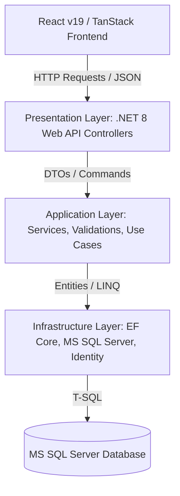

# Backend Implementation Plan (.NET 8 Web API & MS SQL Server)

This document outlines the architecture, database schema, API endpoints, and integration strategy to replace the current frontend mock system with a production-ready **.NET 8 Web API** and **MS SQL Server** database (Server : (localdb)\MSSQLLocalDB, Database Name : dbHindInDisk).

---

## Architecture Overview

We propose a structured, clean-layered architecture for the `.NET 8` Web API backend to ensure maintainability, scalability, and testability.

### Component Breakdown
1. **Presentation Layer (Web API)**: Controllers, Minimal API Endpoints, JWT Authentication Middleware, Swagger documentation.
2. **Application Layer**: Business logic, Services, validation rules, DTOs (Data Transfer Objects), AutoMapper mappings.
3. **Domain/Core Layer**: Enterprise entities, Domain types, and Interface definitions.
4. **Infrastructure Layer**: Entity Framework Core `DbContext`, migrations, Database seeders, JWT token generator, External service connectors.

---

## 1. Database Schema Design (MS SQL Server)

The database schema maps all frontend entities and workflows to MS SQL Server tables using Entity Framework Core Code-First.

```mermaid
erDiagram
    Roles ||--o{ Users : assigns
    Users ||--o{ UserBranches : manages
    Branches ||--o{ UserBranches : managed-by
    Users ||--o{ UserAddresses : has
    Users ||--o{ Orders : places
    Users ||--o{ Reservations : schedules
    Branches ||--o{ Orders : processes
    Branches ||--o{ Reservations : hosts
    Branches ||--o{ BranchMenus : has
    Branches ||--o{ BranchMenuItemPrices : overrides-price-for
    Menus ||--o{ BranchMenus : maps-to
    Menus ||--o{ MenuItemsMapping : contains
    MenuItems ||--o{ MenuItemsMapping : mapped-in
    MenuItems ||--o{ BranchMenuItemPrices : priced-at
    MenuItems ||--o{ MenuItemLabels : has
    MenuLabels ||--o{ MenuItemLabels : mapped-to
    Offers ||--o{ OfferMenus : restricts-to
    Menus ||--o{ OfferMenus : maps-in
    Offers ||--o{ OfferMenuItems : restricts-to
    MenuItems ||--o{ OfferMenuItems : maps-in
    Orders ||--o{ OrderAppliedOffers : applies
    Offers ||--o{ OrderAppliedOffers : applied-in
    MenuItems ||--o{ OrderItems : included-in
    Orders ||--o{ OrderItems : contains
    
    Roles {
        Int64 Id PK "SystemAdmin=1, Admin=2, Customer=3"
        String Name "SystemAdmin, Admin, Customer"
    }

    UserBranches {
        Int64 UserId FK
        Int64 BranchId FK
    }

    Users {
        Int64 Id PK
        String Firstname
        String Lastname
        String Email UK
        String PasswordHash
        String Phone
        Int64 RoleId FK
        DateTime CreatedAt
    }
    
    UserAddresses {
        Int64 Id PK
        Int64 UserId FK
        String AddressLine1
        String AddressLine2 "nullable"
        String City
        String PostalCode
        String Country
        String Type "Home / Office"
    }

    Branches {
        Int64 Id PK
        String Name
        String AddressLine1
        String AddressLine2 "nullable"
        String City
        String PostalCode
        String Country
        TimeOnly WeekdayOpenTime "HH:MM 24h format"
        TimeOnly WeekdayCloseTime "HH:MM 24h format"
        TimeOnly WeekendOpenTime "HH:MM 24h format"
        TimeOnly WeekendCloseTime "HH:MM 24h format"
        String Phone
        String Email
        String GoogleMapsLink
        String GooglePlaceId
        String GoogleBusinessProfileLink
    }

    Menus {
        Int64 Id PK
        String Name
        String Description
        Boolean IsActive
    }

    MenuItems {
        Int64 Id PK
        String Name
        String Description
        String ImageUrl
        Integer SpicyLevel "Dietary: 0-3 scale"
    }

    MenuLabels {
        Int64 Id PK
        String Name "e.g. Gluten, Nuts, Vegetarian, Contains Pork"
        String Type "Allergen / Dietary"
    }

    MenuItemLabels {
        Int64 MenuItemId FK
        Int64 LabelId FK
    }

    MenuItemsMapping {
        Int64 MenuId FK
        Int64 MenuItemId FK
    }

    BranchMenus {
        Int64 BranchId FK
        Int64 MenuId FK
    }

    BranchMenuItemPrices {
        Int64 BranchId FK
        Int64 MenuItemId FK
        Decimal Price
    }

    Orders {
        Int64 Id PK
        Int64 UserId FK
        Int64 BranchId FK
        String OrderType "Pickup / Delivery"
        Decimal Subtotal
        Decimal DeliveryFee
        Decimal Tax
        Decimal Discount
        Decimal Total
        String Status "Pending, Preparing, OutForDelivery, Delivered, Cancelled"
        DateTime CreatedAt
    }

    OrderItems {
        Int64 Id PK
        Int64 OrderId FK
        Int64 MenuId FK
        Int64 MenuItemId FK
        Integer Quantity
        Decimal PriceAtPurchase
    }

    Reservations {
        Int64 Id PK
        Int64 UserId FK
        Int64 BranchId FK
        DateTime Date
        String TimeSlot
        Integer GuestCount
        String SpecialRequests
        String Status "Confirmed, Cancelled"
        DateTime CreatedAt
    }

    Offers {
        Int64 Id PK
        String Title
        String Description
        String OfferType "Coupon / Direct / Conditional"
        String DiscountType "Percent / FixedAmount / FreeShipping / FreeItem"
        Decimal DiscountValue
        String CouponCode "nullable, UK"
        Decimal MinimumOrderAmount "nullable"
        Boolean IsAutoApply
        Integer UsageLimit "nullable"
        Integer UsageCount
        DateTime StartDate
        DateTime EndDate
        Boolean IsActive
    }

    OfferMenus {
        Int64 OfferId FK
        Int64 MenuId FK
    }

    OfferMenuItems {
        Int64 OfferId FK
        Int64 MenuItemId FK
    }

    OrderAppliedOffers {
        Int64 OrderId FK
        Int64 OfferId FK
        Decimal AppliedDiscountAmount
    }
```

---

## 2. API Endpoints Plan

### 🔐 Authentication (`/api/auth`)
* `POST /api/auth/register` — Create new user account.
* `POST /api/auth/login` — Authenticate and return JWT token.
* `GET /api/auth/me` — Retrieve current user profile (JWT protected).
* `PUT /api/auth/profile` — Update account profile details (Name, Phone, Password).

### 🍔 Menu (`/api/menu`)
* `GET /api/menu/categories` — Get all menu categories (Starters, Mains, Breads, etc.).
* `GET /api/menu/items` — Get all active menu items (with search, category, and veg filters).
* `GET /api/menu/items/{name}` — Get individual item details.

### 📍 Locations (`/api/locations`)
* `GET /api/locations` — Get branches metadata (Aarhus & Copenhagen coordinates, address, phone).

### 📅 Table Booking (`/api/reservations`)
* `POST /api/reservations` — Submit a table booking (authenticated/guest).
* `GET /api/reservations/my` — Get order history details for authenticated user.
* `PUT /api/reservations/{id}/cancel` — Cancel a table booking.

### 🛒 Checkout & Orders (`/api/orders`)
* `POST /api/orders` — Create a new order (Pickup or Delivery, handles coupon validation).
* `GET /api/orders/{id}` — Get single order tracking progress details.
* `GET /api/orders/my` — Get history of orders for authenticated user.

---

## 3. Implementation Steps

We will create a new directory inside the project root named `backend` (or a parallel folder layout) to host the C# codebase.

### Step 3.1: Setup the .NET 8 Project
1. Run `dotnet new webapi -o backend/HindIndisk.Api` to bootstrap the Web API.
2. Install NuGet dependencies:
   * `Microsoft.EntityFrameworkCore.SqlServer`
   * `Microsoft.EntityFrameworkCore.Tools`
   * `Microsoft.AspNetCore.Authentication.JwtBearer`
   * `BCrypt.Net-Next` (for secure password hashing)

### Step 3.2: Code the Domain Entities and DbContext
1. Create entity models for `User`, `Branch`, `Role`, `UserBranch`, `UserAddress`, `Menu`, `MenuItem`, `MenuLabel`, `MenuItemLabel`, `MenuItemsMapping`, `BranchMenus`, `BranchMenuItemPrices`, `Order`, `OrderItem`, `Reservation`, `Offer`, `OfferMenus`, `OfferMenuItems`, and `OrderAppliedOffers`.
2. Configure relations, database constraints, and custom converters in `ApplicationDbContext`.
3. Create default seed data (loading restaurant menus, menu items, branch configurations, labels, roles, default users, and active offers/promotions from current `mock.ts`).

### Step 3.3: Implement Repository/Service Layers & Controllers
1. Configure JWT security settings in `appsettings.json` and program pipeline.
2. Implement Authentication Service + Controller.
3. Implement Reservation + Order Processing validation rules (checking active offers, usage limits, auto-applies, and taxes).

### Step 3.4: Integrate with Frontend Core Contexts
1. Setup a dynamic `VITE_API_URL` environment flag in the React frontend.
2. Replace local storage mock updates inside:
   * [AuthContext.tsx](file:///D:/VK/Projects/Personal/AI/PracticalApps/taste-of-denmark-main/src/context/AuthContext.tsx) (connect logins to `/api/auth/login`).
   * [CartContext.tsx](file:///D:/VK/Projects/Personal/AI/PracticalApps/taste-of-denmark-main/src/context/CartContext.tsx) (apply coupons, submit orders via checkout flow).
3. Connect fetching logic on Menu page and Table Reservations using React Query hooks against API endpoints.

---

## Verification Plan

### Automated Tests
- Run database migrations verification.
- Postman or Swagger integration suite testing endpoints (Auth, Menu, Checkout, Reservations).

### Manual Verification
- Deploying the local Web API and SQL Server.
- Verifying client logins, checkout orders placing, and checking SQL Server database entries.
