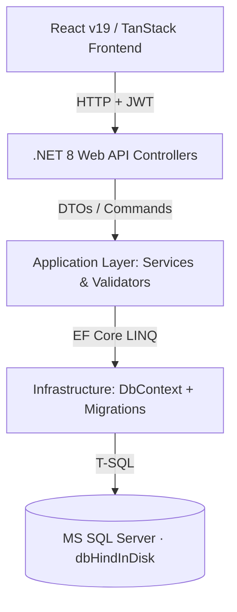

# Recommended Implementation Plan — Hind Indisk Backend

This document is the actionable implementation roadmap for replacing the current `localStorage` / `mock.ts` frontend with a production-ready **.NET 8 Web API** backed by **MS SQL Server** (`(localdb)\MSSQLLocalDB` · database: `dbHindInDisk`).

---

## Architecture Overview



**Layer responsibilities:**
- **Presentation** — Controllers, JWT middleware, Swagger
- **Application** — Business rules, DTOs, AutoMapper, coupon/tax calculation
- **Domain/Core** — Entity classes, interface definitions
- **Infrastructure** — `ApplicationDbContext`, EF Core migrations, seeders, JWT token generator

---

## Execution Order

```
Phase 1 (Foundation) → Phase 2 (Auth) → Phase 3 (Menu & Locations)
    → Phase 4 (Orders & Checkout) → Phase 5 (Reservations)
        → Phase 6 (Cleanup & Hardening) → Phase 7 (Admin Panel)
```

Phases 3–5 can be parallelised across developers once Phase 2 is complete.

---

## Phase 1 — Backend Foundation

**Goal:** Runnable .NET 8 project connected to a local SQL Server with all tables created and seeded.

| Step | Task |
|------|------|
| 1.1 | `dotnet new webapi -o backend/HindIndisk.Api` — scaffold project |
| 1.2 | Install NuGet packages: `Microsoft.EntityFrameworkCore.SqlServer`, `Microsoft.EntityFrameworkCore.Tools`, `Microsoft.AspNetCore.Authentication.JwtBearer`, `BCrypt.Net-Next`, `AutoMapper.Extensions.Microsoft.DependencyInjection` |
| 1.3 | Create all 17 domain entity classes: `User`, `Role`, `UserBranch`, `UserAddress`, `Branch`, `Menu`, `MenuItem`, `MenuLabel`, `MenuItemLabel`, `MenuItemsMapping`, `BranchMenu`, `BranchMenuItemPrice`, `Order`, `OrderItem`, `OrderAppliedOffer`, `Reservation`, `Offer`, `OfferMenu`, `OfferMenuItem` |
| 1.4 | Create `ApplicationDbContext` with all `DbSet<>` properties, FK constraints, cascade rules, and unique indexes (e.g. `Users.Email`, `Offers.CouponCode`) |
| 1.5 | Add `appsettings.json` entries: `ConnectionStrings.Default`, `Jwt.Secret`, `Jwt.Issuer`, `Jwt.Audience`, `Jwt.ExpiryMinutes` |
| 1.6 | Run `dotnet ef migrations add InitialCreate` then `dotnet ef database update` |
| 1.7 | Write `DataSeeder` class that imports current `mock.ts` data — 2 branches, 13 menu items with labels, 3 default offers (`WELCOME10`, `FAMILY20`, `FREEDELIVERY`), 3 roles, and a default `SystemAdmin` user |

**Deliverable:** Empty database with full schema + seed data. No endpoints yet.

---

## Phase 2 — Authentication API

**Goal:** Frontend can register, log in, and receive a JWT. Profile persists across devices.

### Endpoints

| Method | Route | Auth | Description |
|--------|-------|------|-------------|
| POST | `/api/auth/register` | Public | Create account, hash password with BCrypt, assign `RoleId=3` (Customer) |
| POST | `/api/auth/login` | Public | Verify BCrypt hash, return signed JWT (sub=userId, role claim) |
| GET | `/api/auth/me` | Required | Return current user profile DTO |
| PUT | `/api/auth/profile` | Required | Update name, phone; re-hash password if provided |

### Frontend Integration

File: [src/context/AuthContext.tsx](src/context/AuthContext.tsx)

- Replace the 500 ms `setTimeout` mock in `login()` with `POST /api/auth/login`
- Replace the 500 ms `setTimeout` mock in `register()` with `POST /api/auth/register`
- Store the returned JWT via `lsSet("hind-token", jwt)`
- Add a `getAuthHeader()` helper that reads the token for authenticated requests

**Deliverable:** Real login / register flow. User identity survives page refresh and device changes.

---

## Phase 3 — Menu & Locations API

**Goal:** Menu data served from the database; `mock.ts` menu items and branches retired from the menu page.

### Endpoints

| Method | Route | Auth | Description |
|--------|-------|------|-------------|
| GET | `/api/menu/categories` | Public | Distinct category list |
| GET | `/api/menu/items` | Public | All active items; supports `?category=`, `?q=`, `?veg=true`, `?branchId=` query params. Returns `BranchMenuItemPrices` for the requested branch. |
| GET | `/api/menu/items/{name}` | Public | Single item detail + related items in same category |
| GET | `/api/locations` | Public | All branches with address, hours, phone, Google Maps link |

### Frontend Integration

1. Create `src/lib/api/client.ts` — thin `fetch` wrapper that reads `VITE_API_URL` and attaches the JWT `Authorization` header when a token is present.
2. Create React Query hooks in `src/hooks/`:
   - `useMenuItems(filters)` — `GET /api/menu/items`
   - `useMenuItem(name)` — `GET /api/menu/items/{name}`
   - `useBranches()` — `GET /api/locations`
3. Update [src/routes/menu.index.tsx](src/routes/menu.index.tsx) and [src/routes/menu.$name.tsx](src/routes/menu.$name.tsx) to use these hooks instead of importing `menuItems` / `branches` from `mock.ts`.

**Deliverable:** Menu and locations pages driven by live API data. `mock.ts` `menuItems` and `branches` exports become unused.

---

## Phase 4 — Orders & Checkout API

**Goal:** Orders written to SQL Server; coupon validation and pricing enforced server-side.

### Endpoints

| Method | Route | Auth | Description |
|--------|-------|------|-------------|
| POST | `/api/orders` | Required | Create order — server recalculates subtotal, discount, tax, total (never trust client totals). Validates coupon usage limits and `MinimumOrderAmount`. Returns saved order with `id` and `status="Placed"`. |
| GET | `/api/orders/{id}` | Required | Order tracking — status + line items |
| GET | `/api/orders/my` | Required | Full order history for the authenticated user |
| GET | `/api/offers/validate` | Public | `?code=WELCOME10&branchId=1&subtotal=350` — returns discount details or `400` if invalid |

### Frontend Integration

| File | Change |
|------|--------|
| [src/routes/checkout.tsx](src/routes/checkout.tsx) | Replace `place()` body — swap `lsSet("hind-orders", …)` with a React Query mutation to `POST /api/orders`. On success navigate to order tracking with the returned `id`. |
| [src/routes/account.orders.tsx](src/routes/account.orders.tsx) | Replace `lsGet("hind-orders", [])` with `GET /api/orders/my` React Query hook. |
| [src/routes/order-tracking.tsx](src/routes/order-tracking.tsx) | Replace localStorage lookup with `GET /api/orders/{id}`. Remove the fake animation timer — display the real `status` from the API. |
| [src/context/CartContext.tsx](src/context/CartContext.tsx) | `applyCoupon()` — call `GET /api/offers/validate` before accepting the code so invalid or expired coupons are rejected before checkout. |

**Deliverable:** Orders stored in SQL Server. Coupon rules and pricing enforced by the API.

---

## Phase 5 — Reservations API

**Goal:** Reservations written to SQL Server; past bookings retrievable.

### Endpoints

| Method | Route | Auth | Description |
|--------|-------|------|-------------|
| POST | `/api/reservations` | Optional* | Create reservation. Server validates date is in the future and branch is open on that day/time. |
| GET | `/api/reservations/my` | Required | Reservation history for the authenticated user |
| PUT | `/api/reservations/{id}/cancel` | Required | Update `Status` to `Cancelled` |

*Guest bookings accepted — `UserId` nullable if no JWT provided.

### Frontend Integration

| File | Change |
|------|--------|
| [src/routes/reservation.tsx](src/routes/reservation.tsx) | Replace `lsSet("hind-reservations", …)` with a mutation to `POST /api/reservations`. |
| [src/routes/account.reservations.tsx](src/routes/account.reservations.tsx) | Replace `lsGet` with `GET /api/reservations/my` React Query hook. Add a Cancel button wired to `PUT /api/reservations/{id}/cancel`. |

**Deliverable:** Reservations stored in SQL Server with server-side date/time and branch-hours validation.

---

## Phase 6 — Cleanup & Hardening

**Goal:** Remove all remaining `localStorage` mock patterns; lock down the API for production.

| Step | Task |
|------|------|
| 6.1 | Delete `menuItems`, `branches`, `offers`, `reviews` exports from `src/data/mock.ts`. Only static copy (`heroSlides`, `faqs`, `teamMembers`, `timeline`, `galleryImages`) stays. |
| 6.2 | Add `[Authorize]` guards: orders and reservations `POST` require a valid JWT; all `/my` endpoints require auth; menu and locations are public. |
| 6.3 | Add CORS policy in `Program.cs` for `http://localhost:3000` (dev) and production domain. |
| 6.4 | Add `VITE_API_URL` to `.env` (dev) and `.env.production`. Read in `src/lib/api/client.ts`. |
| 6.5 | Add Swagger (`Swashbuckle.AspNetCore`) with JWT bearer support for manual endpoint testing. |
| 6.6 | Implement `OrderAppliedOffers` insert inside the order service to record exactly which offer was applied and the discount amount. |
| 6.7 | Add `UsageCount` increment logic to `Offer` entity when an order is placed with that coupon. |
| 6.8 | Run and fix any TypeScript errors introduced by removing `mock.ts` exports. |

**Deliverable:** Clean codebase — no `localStorage` business logic, no mock data in frontend bundles.

---

## Phase 7 — Admin Panel

**Goal:** Branch staff can manage menu items and update order/reservation statuses.

The stub at [src/routes/admin/](src/routes/admin/) is currently empty. Implement once Phases 1–6 are stable.

### Endpoints

| Method | Route | Role Required | Description |
|--------|-------|---------------|-------------|
| GET/POST | `/api/admin/menu-items` | Admin / SystemAdmin | List and create menu items |
| PUT/DELETE | `/api/admin/menu-items/{id}` | Admin / SystemAdmin | Update or remove a dish |
| GET/PUT | `/api/admin/orders` | Admin / SystemAdmin | List orders; update status (`Accepted`, `Preparing`, `Ready`, `OutForDelivery`, `Completed`) |
| GET | `/api/admin/reservations` | Admin / SystemAdmin | View bookings filtered by branch and date |

Status updates on `/api/admin/orders/{id}` will be reflected immediately in the order-tracking page once it polls the real API (Phase 4).

---

## Key Design Rules

1. **Server always recalculates pricing.** Never trust totals sent from the client. The `POST /api/orders` handler computes subtotal, discount, tax, and total independently using `BranchMenuItemPrices`.
2. **`OrderItems.PriceAtPurchase` is a snapshot.** Price changes after an order is placed must not affect order history.
3. **Prices are per-branch** via `BranchMenuItemPrices`, not on `MenuItems`. Seed data must populate this table for both branches.
4. **JWT lives in `localStorage`.** Use `lsSet("hind-token", jwt)` / `lsGet("hind-token", null)` (already available via `src/lib/storage.ts`). Do not use `httpOnly` cookies to keep the SPA/Cloudflare Workers deployment simple.
5. **`mock.ts` removal is incremental.** Each phase removes only the exports it replaces. Never delete the entire file at once.

---

## Estimated Effort

| Phase | Scope | Effort |
|-------|-------|--------|
| 1 — Foundation | DB schema + seed | 0.5–1 day |
| 2 — Auth | Login / register / JWT | 0.5–1 day |
| 3 — Menu & Locations | Read-only API + React Query hooks | 0.5–1 day |
| 4 — Orders & Checkout | Full order flow + coupon validation | 1–1.5 days |
| 5 — Reservations | Booking flow | 0.5 day |
| 6 — Cleanup | Remove mocks, harden API | 0.5 day |
| 7 — Admin Panel | CRUD + status management | 1–2 days |
| **Total** | | **4.5–8 days** |


It covers:

Architecture diagram (Mermaid) showing the 4-layer .NET structure
Execution order with parallelisation note for Phases 3–5
7 phases — each with a table of specific steps, exact endpoint signatures, HTTP methods, auth requirements, and the precise frontend files that need updating
Key design rules — server-side pricing recalculation, PriceAtPurchase snapshot, per-branch pricing, JWT storage approach, incremental mock.ts removal


## Database: MS SQL Server (dbHindInDisk)
**Connection: (localdb)\MSSQLLocalDB · EF Core Code-First**

Entity Map (17 tables): 

Table	Purpose	Key Fields
Roles	SystemAdmin / Admin / Customer	Id, Name
Users	All user accounts	Id, Email (unique), PasswordHash, RoleId FK
UserBranches	Admin↔branch assignment	UserId FK, BranchId FK
UserAddresses	Saved delivery addresses	UserId FK, Type (Home/Office)
Branches	Restaurant locations	Separate weekday/weekend open/close times, GooglePlaceId
Menus	Named menu categories	Name, IsActive
MenuItems	Individual dishes	SpicyLevel (0–3), no base price — price is per-branch
MenuLabels	Allergen/dietary tags	Type (Allergen / Dietary), e.g. "Vegetarian", "Gluten"
MenuItemLabels	Dish↔label join	MenuItemId FK, LabelId FK
MenuItemsMapping	Dish↔menu join	MenuId FK, MenuItemId FK
BranchMenus	Branch↔menu join	BranchId FK, MenuId FK
BranchMenuItemPrices	Per-branch pricing	BranchId FK, MenuItemId FK, Price
Orders	Customer orders	OrderType (Pickup/Delivery), full pricing breakdown, Status
OrderItems	Line items per order	PriceAtPurchase (snapshot, not FK to live price)
OrderAppliedOffers	Discounts applied to an order	AppliedDiscountAmount
Reservations	Table bookings	TimeSlot, GuestCount, Status (Confirmed/Cancelled)
Offers	Coupons & promotions	OfferType, DiscountType, CouponCode, IsAutoApply, usage tracking