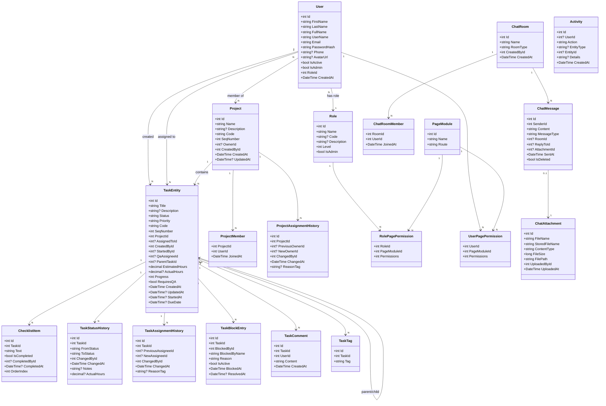
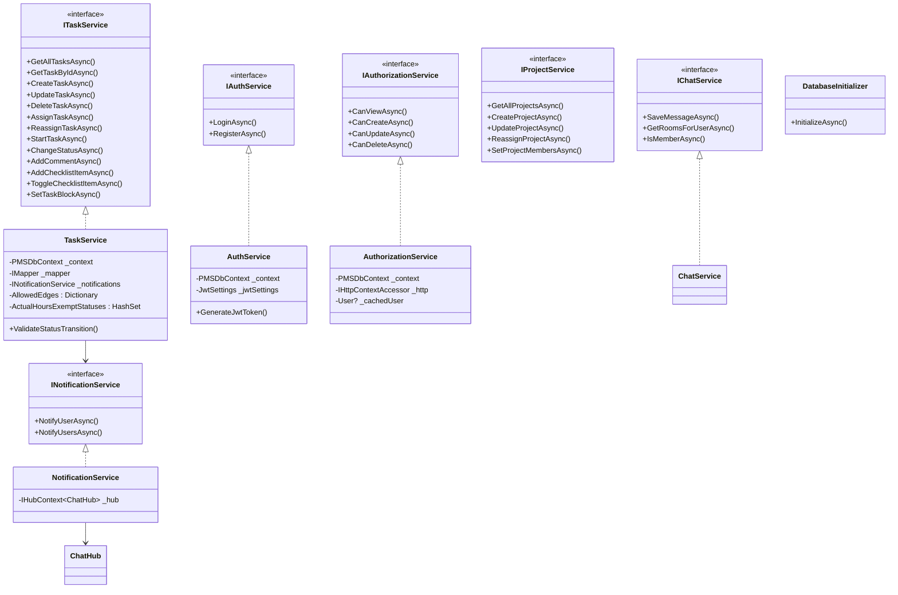
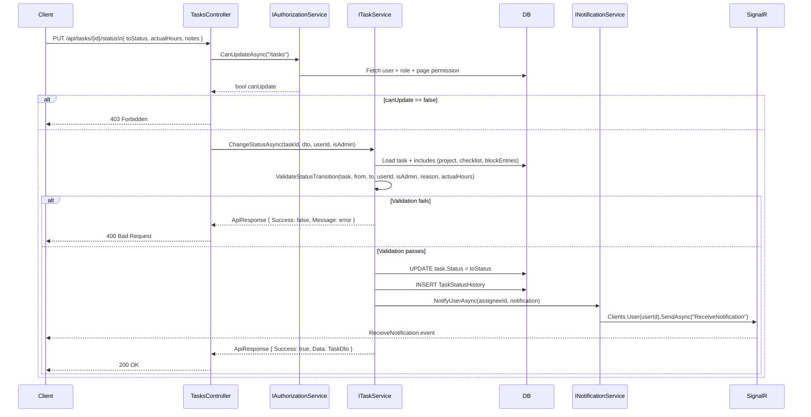
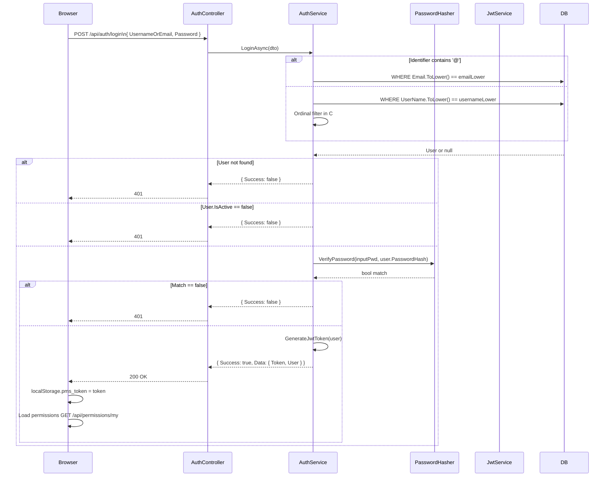
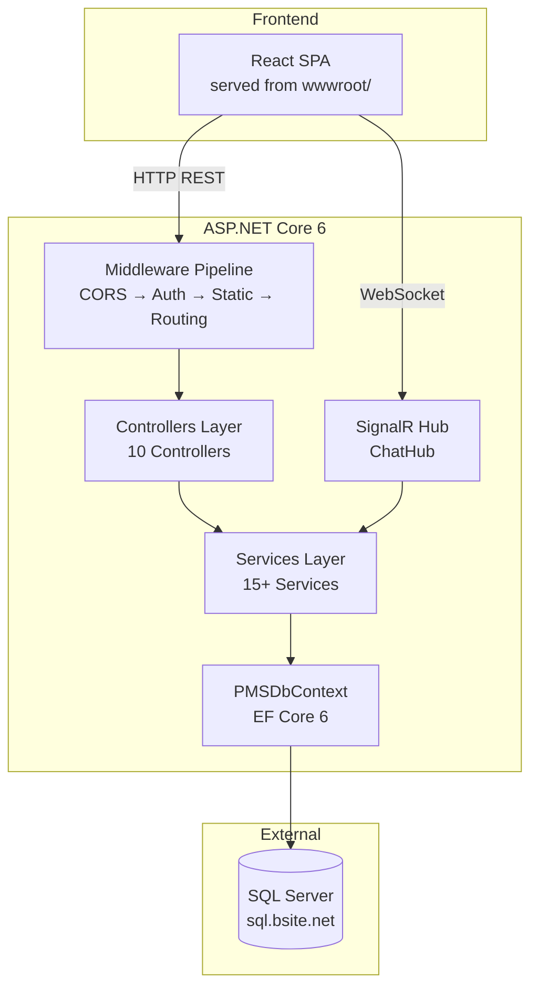
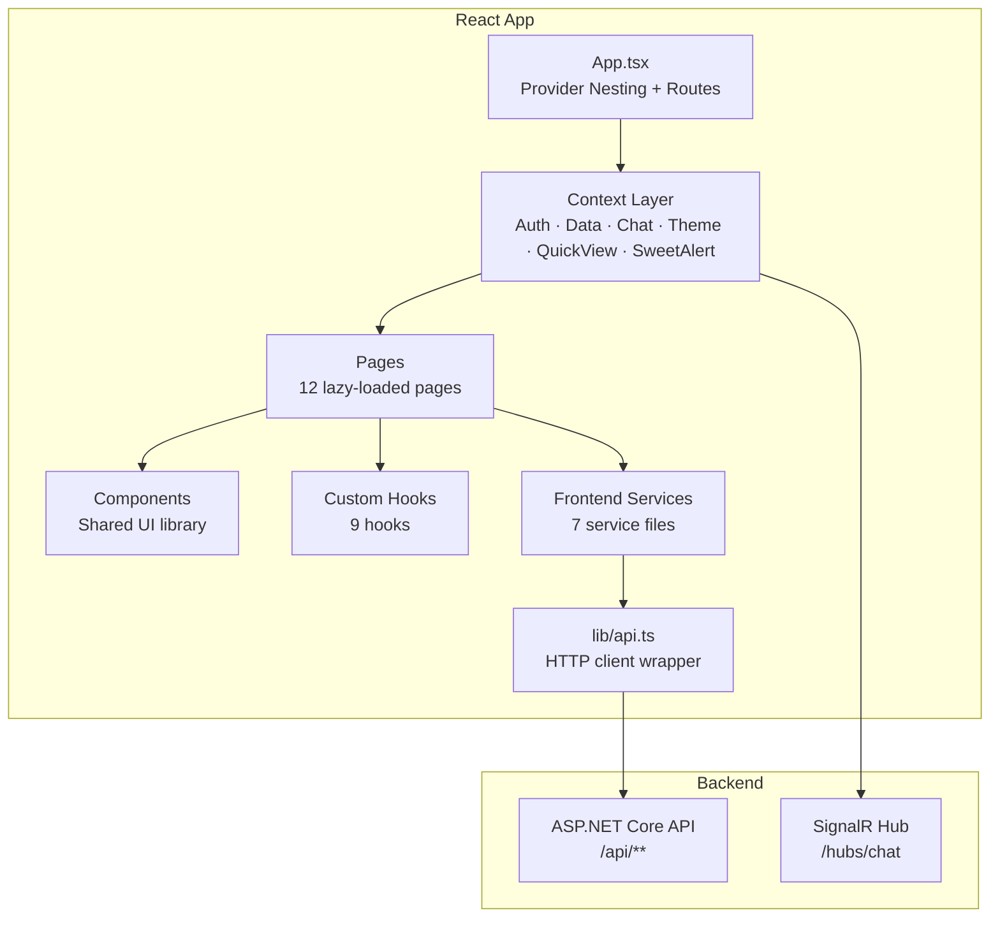
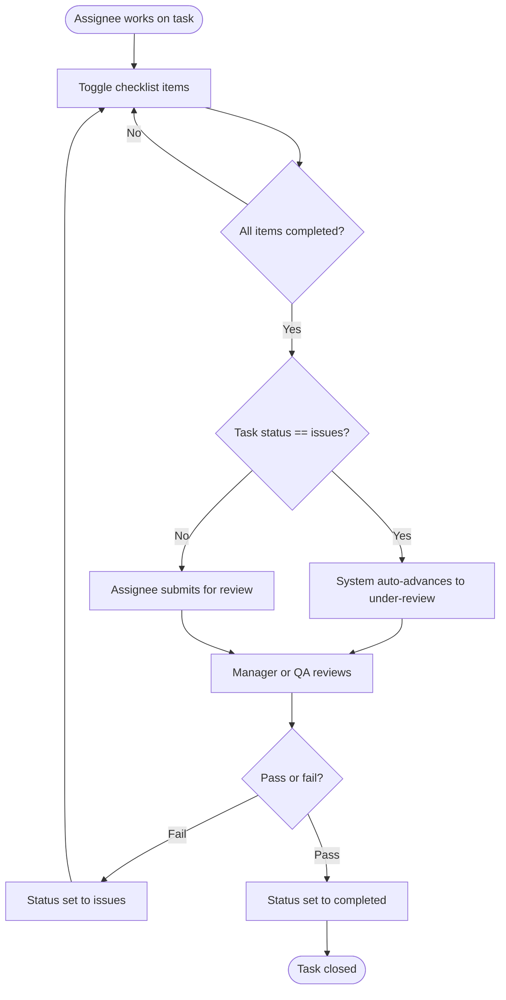

# Phase 11 – UML Documentation

**Source evidence:** `Data/PMSDbContext.cs`, `DTOs/GeneralDtos.cs`, `Services/`, `Controllers/`, Phase 1–10 analysis

All diagrams use Mermaid syntax.

---

## 11.1 Use Case Diagram

```mermaid
graph TD
    subgraph Actors
        UA[Unauthenticated User]
        TM[Team Member]
        MGR[Manager / Project Owner]
        ADM[Admin Role]
        SA[SystemAdmin]
    end

    subgraph Authentication
        UC01[Register Account]
        UC02[Login]
        UC03[Validate Session]
        UC04[Change Own Password]
        UC05[Reset User Password]
    end

    subgraph Projects
        UC10[View Projects]
        UC11[Create Project]
        UC12[Edit Project]
        UC13[Delete Project]
        UC14[Manage Members]
        UC15[Reassign Project Owner]
    end

    subgraph Tasks
        UC20[View Tasks]
        UC21[Create Task]
        UC22[Edit Task]
        UC23[Delete Task]
        UC24[Assign Task]
        UC25[Reassign Task]
        UC26[Start Task]
        UC27[Change Status]
        UC28[Add Comment]
        UC29[Manage Checklist]
        UC30[Block / Unblock Task]
    end

    subgraph Users
        UC40[View Users]
        UC41[Create User]
        UC42[Edit User]
        UC43[Activate / Deactivate]
    end

    subgraph Roles
        UC50[View Roles]
        UC51[Create / Edit Role]
        UC52[Manage Permissions]
    end

    subgraph Chat
        UC60[Send Global Message]
        UC61[Send Room Message]
        UC62[Create / Join Room]
        UC63[Send File]
        UC64[View Online Users]
    end

    subgraph Reports
        UC70[View Dashboard Stats]
        UC71[View Own Effort]
        UC72[View All Users Effort]
    end

    UA --> UC01
    UA --> UC02

    TM --> UC03
    TM --> UC04
    TM --> UC10
    TM --> UC20
    TM --> UC26
    TM --> UC27
    TM --> UC28
    TM --> UC29
    TM --> UC30
    TM --> UC60
    TM --> UC61
    TM --> UC62
    TM --> UC63
    TM --> UC64
    TM --> UC70
    TM --> UC71

    MGR --> TM
    MGR --> UC21
    MGR --> UC24
    MGR --> UC25

    ADM --> MGR
    ADM --> UC11
    ADM --> UC12
    ADM --> UC13
    ADM --> UC14
    ADM --> UC15
    ADM --> UC22
    ADM --> UC23
    ADM --> UC40
    ADM --> UC41
    ADM --> UC42
    ADM --> UC43
    ADM --> UC50
    ADM --> UC51
    ADM --> UC05
    ADM --> UC72

    SA --> ADM
    SA --> UC52
```

---

## 11.2 Class Diagram — Core Domain Entities

---

## 11.3 Class Diagram — Service Layer

---

## 11.4 Sequence Diagram — Task Status Change

---

## 11.5 Sequence Diagram — User Login

---

## 11.6 Component Diagram — Backend

---

## 11.7 Component Diagram — Frontend

---

## 11.8 Activity Diagram — Checklist-Gated Task Completion

