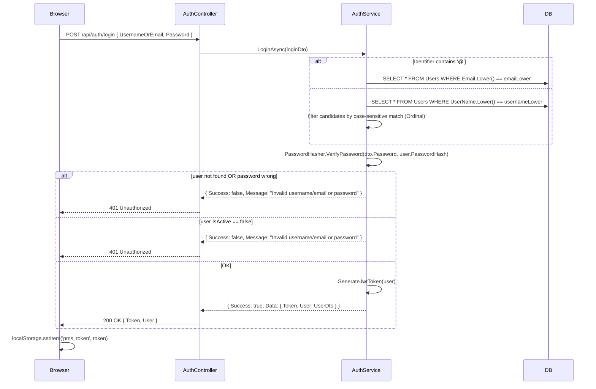

# Phase 4 – Authentication & Authorization

**Source evidence:** `Services/AuthService.cs`, `Services/AuthorizationService.cs`, `Program.cs`, `Controllers/AuthController.cs`, `Controllers/PermissionsController.cs`, `Data/PMSDbContext.cs`

---

## 4.1 Authentication Overview

| Property | Value |
|---|---|
| Scheme | JWT Bearer (HMAC-SHA256) |
| Token location | `Authorization: Bearer <token>` header |
| SignalR token location | `?access_token=<token>` query string (WebSocket upgrade) |
| Token lifetime | 420 minutes (7 hours) |
| Issuer | `PMS` |
| Audience | `PMS` |
| Signing key | `PMS_Secure_Key_For_JWT_Token_2024_MinLength32Chars` (hardcoded in `appsettings.json`) |
| Password hashing | PBKDF2 via `Microsoft.AspNetCore.Cryptography.KeyDerivation` |
| Token storage (frontend) | `localStorage.pms_token` |
| Refresh token | **Not implemented** |
| HTTPS | **Not enforced** — `UseHttpsRedirection()` is commented out |

---

## 4.2 Login Flow



---

## 4.3 JWT Token Structure

### Claims

| Claim | Value | Source |
|---|---|---|
| `ClaimTypes.NameIdentifier` | `user.Id` (int as string) | `AuthService.GenerateJwtToken` |
| `ClaimTypes.Email` | `user.Email` | `AuthService.GenerateJwtToken` |
| `ClaimTypes.Role` | `user.Role.Name` | `AuthService.GenerateJwtToken` |
| `"role"` (custom) | `user.Role.Name` | `AuthService.GenerateJwtToken` (duplicate for compatibility) |

> **Note:** No `IsAdmin` claim is embedded. Admin status is resolved at runtime from the DB via `AuthorizationService`.

### Token Validation Parameters (`Program.cs`)

| Parameter | Value |
|---|---|
| `ValidateIssuer` | `true` |
| `ValidateAudience` | `true` |
| `ValidateLifetime` | `true` |
| `ValidateIssuerSigningKey` | `true` |
| `ValidIssuer` | `"PMS"` |
| `ValidAudience` | `"PMS"` |

---

## 4.4 Token Validation on App Load

On every browser refresh, `AuthContext` calls `GET /api/auth/validate`:
- Validates JWT via ASP.NET Core middleware
- Fetches fresh user profile from DB (role, active status)
- Returns 401 if user deleted or deactivated since token issuance
- Updates `AuthContext.user` state

---

## 4.5 Password Hashing

Algorithm: **PBKDF2** via `Microsoft.AspNetCore.Cryptography.KeyDerivation`

```csharp
// HashPassword: uses KeyDerivation.Pbkdf2 with HMACSHA256, 100,000 iterations
// VerifyPassword: recomputes and compares hash using stored salt (embedded in hash string)
```

Implemented in `PasswordHasher` class inside `Services/AuthService.cs`.

**Reset Password:** SystemAdmin-only endpoint generates a cryptographically random 12-char Base64 temporary password via `RandomNumberGenerator.Create()`. Returned in plain text in the API response — requires secure channel.

---

## 4.6 Authorization Model

### Two-Level Permission System

```
Request arrives
       │
       ▼
[JWT Middleware]  — validates token signature, expiry, issuer, audience
       │
       ▼
[AuthorizationService.CanXxxAsync(route)]
       │
       ├─ IsSystemAdmin (RoleId == 1)?  ──► ALLOW (full access)
       ├─ IsAdmin (Role.IsAdmin == true)?  ──► ALLOW (full access)
       │
       ├─ Lookup PageModule by route string
       │
       ├─ UserPagePermission exists for this user?  ──► Apply user-level bitmap
       │
       └─ RolePagePermission exists for this role?  ──► Apply role-level bitmap
              (no row = no access)
```

### Permission Bits

| Bit | Decimal | Method |
|---|---|---|
| 0 | 1 | `CanViewAsync()` |
| 1 | 2 | `CanCreateAsync()` |
| 2 | 4 | `CanUpdateAsync()` |
| 3 | 8 | `CanDeleteAsync()` |

`15` = all bits set = full access.

### Priority Order

1. **SystemAdmin** (`RoleId == 1`) → always full access, no DB lookup
2. **IsAdmin role** (`Role.IsAdmin == true`) → always full access
3. **User-level override** (`UserPagePermissions`) → overrides role
4. **Role-level permission** (`RolePagePermissions`) → default
5. **No row found** → `CanView` returns `true` (open), `CanCreate/Update/Delete` returns `false`

### Per-Request User Cache

`AuthorizationService` is `AddScoped` and caches the loaded `User` entity in `_cachedUser` to avoid repeated DB queries within a single HTTP request.

---

## 4.7 Role-Based Access Matrix (Seeded Values)

| Role | Code | IsAdmin | Default Permissions |
|---|---|---|---|
| System Administrator | ADMIN | true | 15 (all pages, all bits) |
| Project Manager | PM | false | 0 (all pages, no access by default) |
| Senior Software Developer | SSD | false | 0 |
| Junior Software Developer | JSD | false | 0 |
| Mobile App Developer | MAD | false | 0 |
| Wordpress Developer | WPD | false | 0 |
| UI/UX Designer | UXD | false | 0 |
| Quality Assurance (QA) Tester | QAT | false | 0 |
| Graphic Designer | GD | false | 0 |
| Technical Content Creator | TCC | false | 0 |
| Social Media Manager | SMM | false | 0 |

> Non-admin roles start with `Permissions = 0` on all page modules. Admins must explicitly grant permissions via `/api/permissions/role/{roleId}`.

---

## 4.8 Page Modules (Seeded)

| Id | Name | Route |
|---|---|---|
| 1 | Dashboard | `/` |
| 2 | Projects | `/projects` |
| 3 | Tasks | `/tasks` |
| 4 | Users | `/users` |
| 5 | Roles | `/roles` |

> Dashboard (`/`) and root paths always return `CanView = true` regardless of permissions (hardcoded in `AuthorizationService.CanViewAsync`).

---

## 4.9 Special Authorization Rules (Beyond Page Permissions)

| Endpoint | Extra Rule |
|---|---|
| POST `/api/projects` | Requires `IsAdmin` AND `CanCreate(/projects)` |
| PUT `/api/projects/{id}` | Requires `IsAdmin` AND `CanUpdate(/projects)` |
| DELETE `/api/projects/{id}` | Requires `IsAdmin` AND `CanDelete(/projects)` |
| POST `/api/tasks/{id}/comments` | Task creator, current assignee, or project owner/creator only |
| PUT `/api/tasks/{id}/assign` | Task creator only |
| POST `/api/tasks/{id}/start` | Assignee only (enforced in service) |
| PUT `/api/tasks/{id}/status` | State-machine edges define who can transition |
| PUT `/api/tasks/{id}/status` (reopen) | Manager-only (`reopened` status) |
| POST `/api/users/{id}/reset-password` | SystemAdmin role (`role.Name == "systemadmin"` or `"admin"`) only |
| GET/PUT/DELETE `/api/permissions/**` (admin routes) | `IsSystemAdmin` (RoleId == 1) only |
| GET `/api/users` | Excludes `Id <= 1` from result |
| GET `/api/users/assignable` | Excludes `RoleId == 1` from result |
| GET `/api/roles/{id}`, GET `/api/users/{id}` | `id <= 1` returns 403 |

---

## 4.10 SignalR Authentication

JWT is passed via `?access_token=<token>` query string during WebSocket upgrade (required because browsers cannot set custom headers on WebSocket connections).

Configured in `Program.cs`:
```csharp
options.Events = new JwtBearerEvents
{
    OnMessageReceived = ctx => {
        var token = ctx.Request.Query["access_token"];
        if (!string.IsNullOrEmpty(token) && ctx.Request.Path.StartsWithSegments("/hubs"))
            ctx.Token = token;
        return Task.CompletedTask;
    }
};
```

---

## 4.11 Session Management

| Aspect | Implementation |
|---|---|
| Session storage | Stateless — JWT only, no server-side session |
| Logout | Frontend removes `localStorage.pms_token` (no server-side token invalidation) |
| Token expiry | 420 minutes; no refresh mechanism |
| Inactive account blocking | Checked on login AND on `GET /api/auth/validate` |
| Token revocation | **Not implemented** — deactivating a user blocks login but does not invalidate existing tokens until they expire |

---

## 4.12 Self-Registration Rules

| Rule | Value |
|---|---|
| Allowed | Yes (`POST /api/auth/register` is `[AllowAnonymous]`) |
| Auto-assigned role | Lowest-privilege non-admin role (ordered by `Level ASC`) |
| Never auto-assigns | `RoleId = 1` (System Administrator) |
| If no non-admin role exists | Returns 503-equivalent error message |
