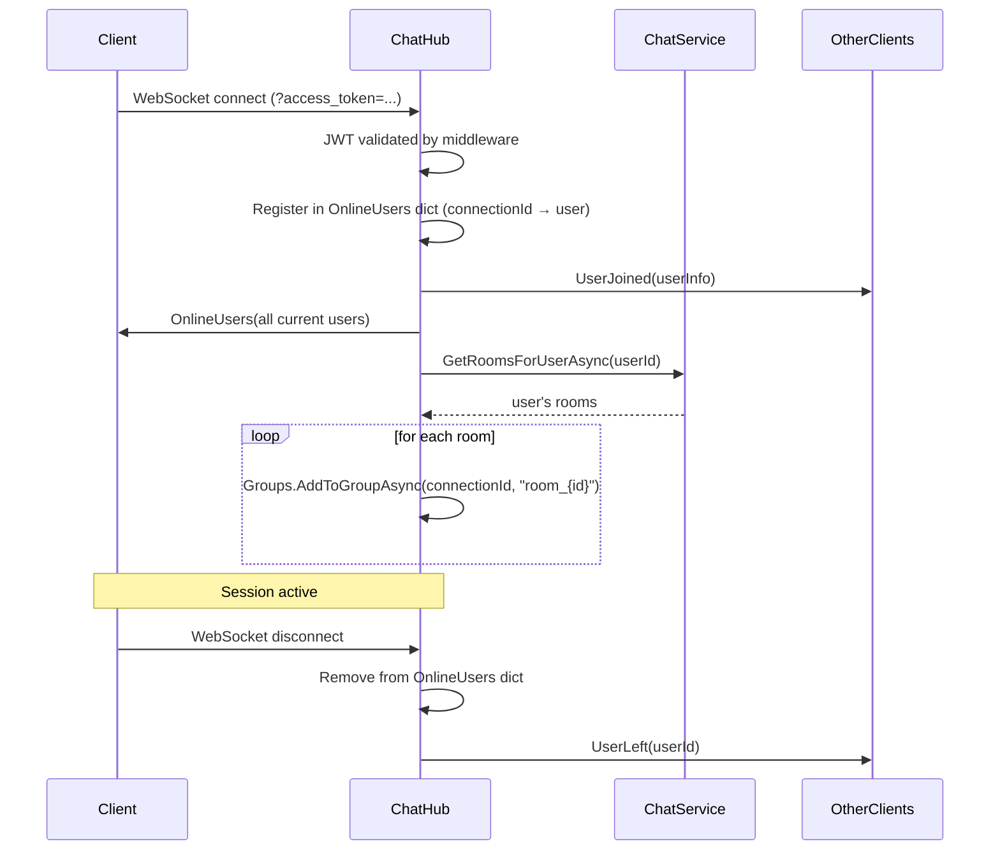
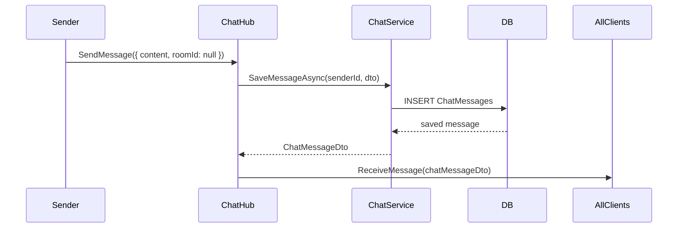
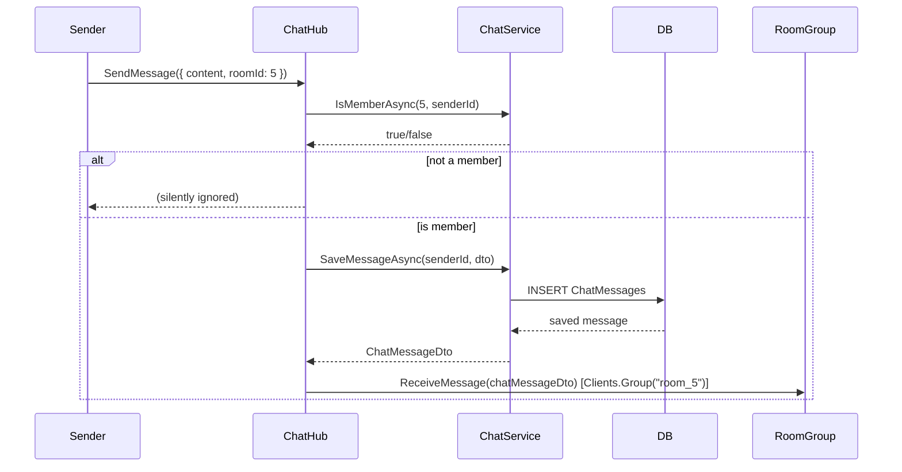
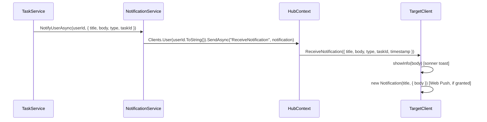
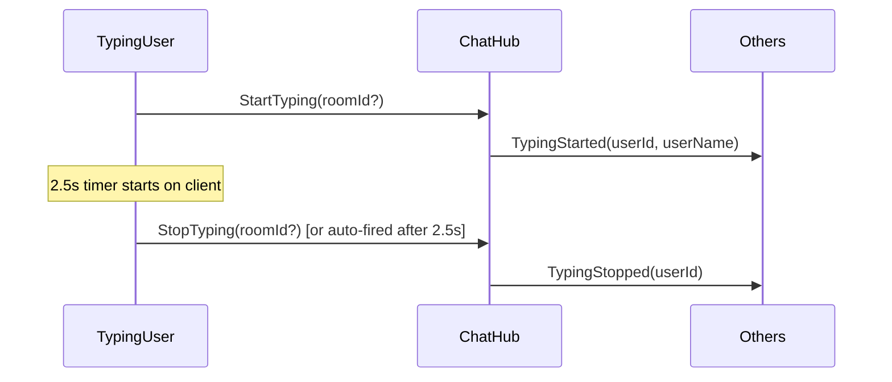

# Phase 7 – SignalR Analysis

**Source evidence:** `Hubs/ChatHub.cs`, `Services/NotificationService.cs`, `Services/ChatService.cs`, `ClientApp/src/context/ChatContext.tsx`, `Program.cs`

---

## 7.1 Hub Overview

| Property | Value |
|---|---|
| Hub Class | `ChatHub` |
| Endpoint | `/hubs/chat` |
| Authorization | `[Authorize]` (JWT required) |
| Transport | WebSockets (preferred) + Long-Polling (fallback) |
| Token delivery | `?access_token=<token>` query string on WebSocket upgrade |
| Online user store | `static ConcurrentDictionary<string, OnlineUserDto>` (in-memory, per-process) |
| DI dependency | `IChatService` |

---

## 7.2 Hub Methods (Client → Server)

| Method | Parameters | Description |
|---|---|---|
| `SendMessage` | `SendMessageDto { content, messageType, replyToId?, roomId?, attachmentId? }` | Send text or file message to global channel or room |
| `JoinRoom` | `roomId: int` | Add caller's connection to a SignalR room group |
| `StartTyping` | `roomId?: int` | Notify others that the user started typing |
| `StopTyping` | `roomId?: int` | Notify others that the user stopped typing |

---

## 7.3 Server → Client Events

| Event | Payload | Sent To | Trigger |
|---|---|---|---|
| `ReceiveMessage` | `ChatMessageDto` | Global: `Clients.All`; Room: `Clients.Group("room_{id}")` | `SendMessage` hub method |
| `ReceiveNotification` | `NotificationDto { title, body, type, taskId?, timestamp }` | `Clients.User(userId)` | `NotificationService.NotifyUserAsync()` |
| `UserJoined` | `OnlineUserDto { userId, userName, avatarUrl, connectedAt }` | `Clients.Others` | `OnConnectedAsync` |
| `UserLeft` | `userId: int` | `Clients.Others` | `OnDisconnectedAsync` |
| `OnlineUsers` | `List<OnlineUserDto>` | `Clients.Caller` | `OnConnectedAsync` (initial snapshot) |
| `TypingStarted` | `userId: int, userName: string` | Others in room or global | `StartTyping` hub method |
| `TypingStopped` | `userId: int` | Others in room or global | `StopTyping` hub method |

---

## 7.4 Connection Lifecycle



---

## 7.5 Message Flow

### Global Channel Message



### Room Message



---

## 7.6 Notification Flow (Task Events)

Notifications are pushed from business services (e.g. `TaskService`) via `INotificationService`, which uses `IHubContext<ChatHub>` to target specific users:



---

## 7.7 Typing Indicator Flow



Client-side: `startTyping()` in `ChatContext.tsx` sets a 2500 ms timer that auto-calls `StopTyping` if no further input.

---

## 7.8 Room Group Strategy

- Each chat room maps to a SignalR group named `"room_{roomId}"`.
- Connections are added to groups on connect (for existing rooms) and on `JoinRoom` invocation (for newly joined rooms).
- Global channel uses `Clients.All` — no group.
- `RoomGroup(roomId)` is a static helper: `$"room_{roomId}"`.

---

## 7.9 Online Presence Store

```csharp
private static readonly ConcurrentDictionary<string, OnlineUserDto> OnlineUsers = new();
// Key: ConnectionId (unique per WebSocket connection)
// Value: OnlineUserDto { UserId, UserName, AvatarUrl, ConnectedAt }
```

**Limitations:**
- In-memory static store — not shared across multiple server instances
- One user with multiple browser tabs will appear once per connection (multiple entries for same UserId)
- Does not persist across process restarts

---

## 7.10 Client-Side SignalR Setup (`ChatContext.tsx`)

```typescript
new signalR.HubConnectionBuilder()
  .withUrl('/hubs/chat', {
    accessTokenFactory: () => localStorage.pms_token,
    transport: WebSockets | LongPolling,
  })
  .withAutomaticReconnect([0, 2000, 5000, 10000, 30000])
  .configureLogging(signalR.LogLevel.Warning)
  .build()
```

- Connection started when `user` is set in `AuthContext`
- Stopped on component unmount (when `user.id` changes)
- Reconnect events update `isConnected` state
- History loaded after successful connection (`loadHistory()` + `loadRooms()`)

---

## 7.11 NotificationService

`NotificationService` is the server-side push mechanism used by business services to reach specific users:

```csharp
// Single user
NotifyUserAsync(userId, notification) 
→ hub.Clients.User(userId.ToString()).SendAsync("ReceiveNotification", notification)

// Multiple users (parallel)
NotifyUsersAsync(userIds, notification)
→ Task.WhenAll(userIds.Distinct().Select(id => NotifyUserAsync(id, notification)))
```

Uses SignalR's built-in User targeting, which resolves connections by `NameIdentifier` claim (= `user.Id`).
