# Phase 9 – Workflow Documentation

**Source evidence:** `Services/TaskService.cs`, `Services/AuthService.cs`, `Services/ProjectService.cs`, `Controllers/TasksController.cs`, `Phase8_Business_Rules.md`

All flowcharts are Mermaid diagrams.

---

## 9.1 User Registration & Login Flow

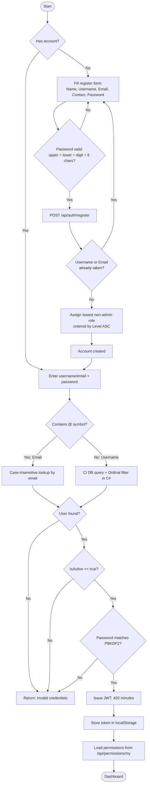

---

## 9.2 Task Status Workflow

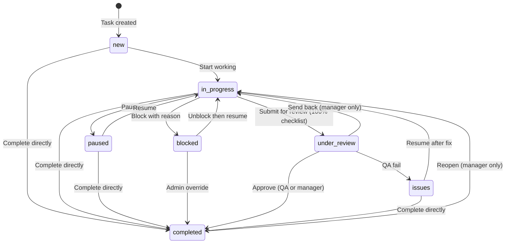

---

## 9.3 Task Status Change Validation Flow

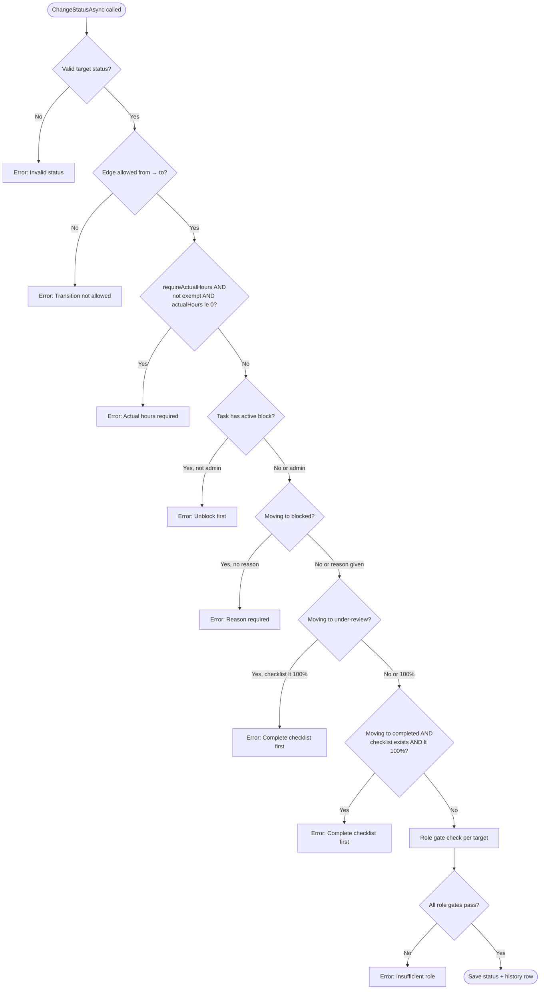

---

## 9.4 Task Assignment Flow

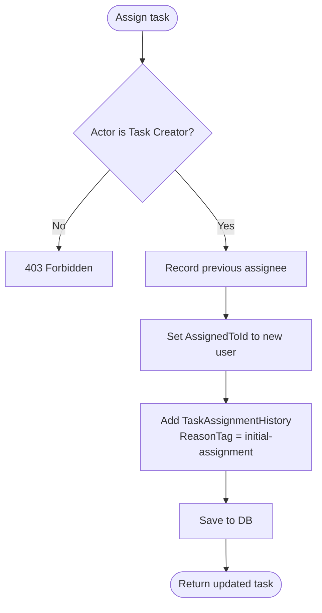

---

## 9.5 Task Reassignment Flow

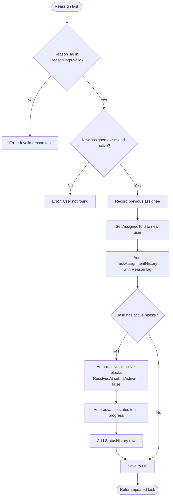

---

## 9.6 Checklist Gate & Auto-Advance Flow

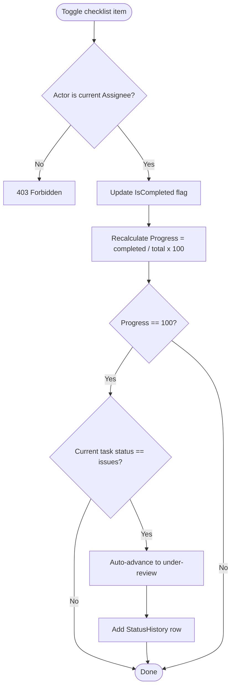

---

## 9.7 Project Ownership Transfer Flow

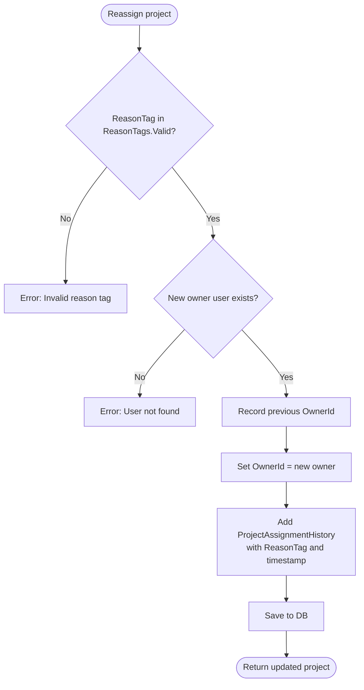

---

## 9.8 Permission Check Flow (Per Request)

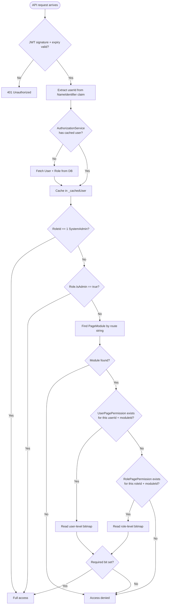

---

## 9.9 Chat Message Send Flow

```mermaid
flowchart TD
    A([User invokes SendMessage]) --> B{Has roomId?}
    B -- Yes --> C{IsMemberAsync returns true?}
    C -- No --> SILENT([Silently ignored])
    C -- Yes --> D[ChatService.SaveMessageAsync]
    B -- No: global --> D
    D --> E[INSERT into ChatMessages]
    E --> F{Room message?}
    F -- Yes --> G[Clients.Group room_{id} SendAsync ReceiveMessage]
    F -- No --> H[Clients.All SendAsync ReceiveMessage]
    G --> DONE([Recipients receive message])
    H --> DONE
```

---

## 9.10 User Deactivation Impact Flow

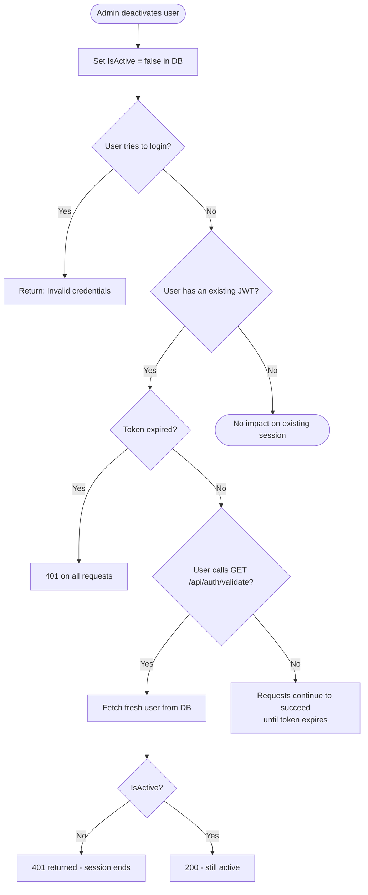

---

## 9.11 Task Deletion Pre-Check Flow

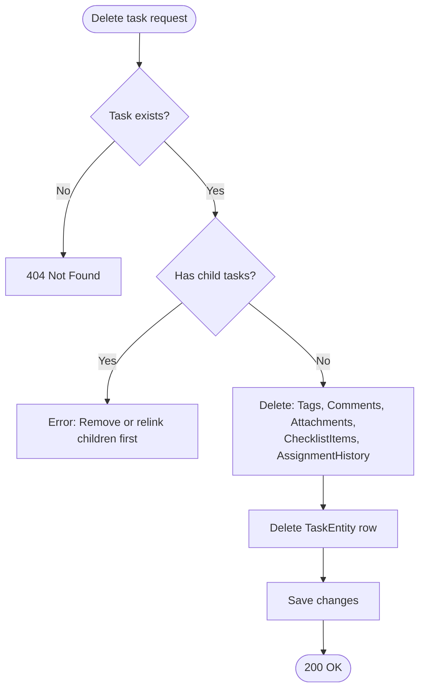

---

## 9.12 Full Task Lifecycle Summary

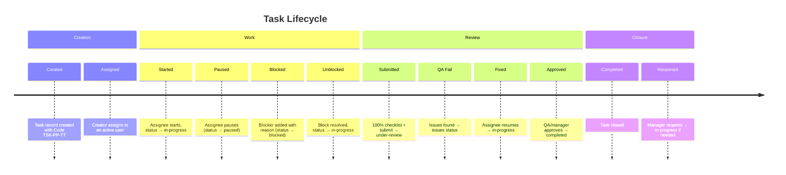
